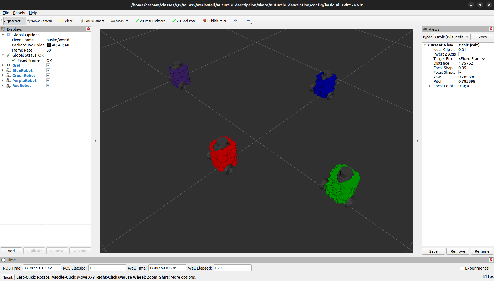

# Nuturtle  Description
URDF files for Nuturtle Sleepiest Soldier
* ros2 launch nuturtle_description load_one.launch.py to see the robot in rviz.
* ros2 launch nuturtle_description load_all.launch.py to see four copies of the robot in rviz.

* The rqt_graph when all four robots are visualized (Nodes Only, Hide Debug) is:

# Launch File Details
  * `ros2 launch nuturtle_description load_one.launch.py --show-args`

    ```
    Arguments (pass arguments as '\<name>:=\<value>'):
  
    'use_rviz':
        determines whether or not rviz is launched
        (default: 'true')

    'use_jsp':
        determines whether ot not the joint_state_publisher is used to publish joint states
        (default: 'true')

    'color':
        determines the color of the turtlebot in rviz. Valid choices are: ['red', 'green', 'blue', 'purple']
        (default: 'purple')```
* `ros2 launch nuturtle_description load_all.launch.xml --show-args`
  ```
  Arguments (pass arguments as '<name>:=<value>'):

    'use_rviz':
        determines whether or not rviz is launched
        (default: 'true')

    'use_jsp':
        determines whether ot not the joint_state_publisher is used to publish joint states
        (default: 'true')

    'color':
        determines the color of the turtlebot in rviz. Valid choices are: ['red', 'green', 'blue', 'purple']
        (default: 'purple')

  ```